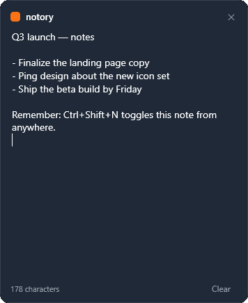
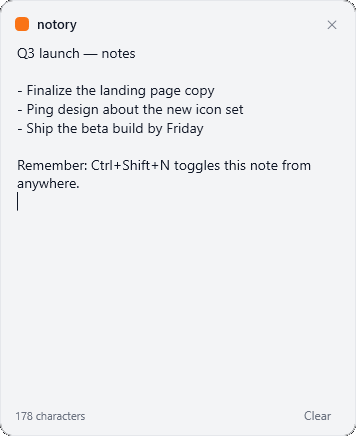

# notory

**English | [Türkçe](README.tr.md)**

A lightweight Windows quick-note scratchpad.

notory lives quietly in your system tray. Press a hotkey and a small note pops up
wherever you are — jot something down, press the hotkey again to tuck it away.
Whatever you type is saved automatically and restored next time, so it's always
the same note waiting for you.

<p align="center">
  
  
</p>

## Features

- **Always a keystroke away** — global hotkey (`Ctrl + Shift + N`) shows or hides
  the note from any app.
- **Auto-saves** — every keystroke is written to disk; nothing to remember to save.
- **Survives restarts** — your note is restored exactly as you left it.
- **Dark or light** — pick a **System**, **Dark**, or **Light** theme from the
  menu. Defaults to **System**, following your Windows setting.
- **Start with Windows** — optional, toggled from the menu.
- **Self-updating** — when a new version ships, notory offers it from the tray; one click installs it.
- **English & Turkish** — switch the interface language from the menu.
- **Private by design** — everything stays on your machine; nothing is uploaded.

## Download

Grab the latest build from the [**Releases**](https://github.com/volkanturhan/notory/releases/latest) page:

- **notory-setup-…exe** — installer (recommended). No admin rights needed, and notory keeps itself up to date from here on.
- **notory-…exe** — portable single file; just run it, nothing to install.

Both are self-contained, so you don't need .NET installed. Windows 10/11, 64-bit.

notory starts quietly in the system tray — **no window pops up**. That's normal;
press the hotkey (or double-click the tray icon) to open your note.

## Run from source

Prefer to build it yourself? You'll need the [.NET 8 SDK](https://dotnet.microsoft.com/download/dotnet/8.0)
(the SDK, not just the runtime) on Windows.

```bash
git clone https://github.com/volkanturhan/notory.git
cd notory
dotnet run --project notory/notory.csproj
```

## How to use

1. Launch notory — it starts quietly in the system tray.
2. Press **`Ctrl + Shift + N`** (or double-click the tray icon) to open the note.
3. Type anything — it saves as you go. **Clear** empties it.
4. Press **`Ctrl + Shift + N`** again to hide the note; it's still there next time.

Right-click the tray icon for **Open note**, **Start with Windows**, language, and
**Quit**.

## Where your data lives

Your note is stored locally at `%APPDATA%\notory\note.txt` and never leaves your
machine; preferences live next to it in `settings.json`.

## Build a shareable exe

Want a standalone `.exe` and installer you can hand to someone without the SDK?
Build them yourself — the output isn't checked into the repo:

```bash
# Builds into dist/release (portable notory.exe + Windows installer).
# (The installer step needs Inno Setup: winget install JRSoftware.InnoSetup)
pwsh tools/release.ps1
```

## Tech

- C# / WPF on .NET 8 (Windows)
- No third-party dependencies

## License

MIT — see [LICENSE](LICENSE).
