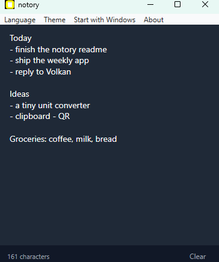

# notory

**[English](README.md) | Türkçe**

Hafif bir Windows hızlı not defteri.

notory sistem tepsisinde sessizce durur. Bir kısayola bas, nerede olursan ol küçük
bir not açılsın — bir şey karala, tekrar bas, kenara çekilsin. Yazdığın her şey
otomatik kaydedilir ve bir dahakine geri yüklenir; hep aynı not seni bekler.

<p align="center">
  
</p>

## Özellikler

- **Hep bir tuş uzakta** — global kısayol (`Ctrl + Shift + N`) notu her uygulamadan
  gösterir ya da gizler.
- **Otomatik kaydeder** — her tuş diske yazılır; kaydetmeyi hatırlamana gerek yok.
- **Yeniden başlatmaya dayanır** — notun bıraktığın gibi geri yüklenir.
- **Koyu ya da açık** — menüden **Sistem**, **Koyu** ya da **Açık** temasını seç.
  Varsayılan **Sistem**, yani Windows ayarını takip eder.
- **Windows ile başla** — isteğe bağlı, menüden aç/kapa.
- **Kendini günceller** — yeni sürüm çıktığında notory bunu tepsiden önerir; tek tıkla kurulur.
- **İngilizce & Türkçe** — arayüz dilini menüden değiştir.
- **Tasarımı gereği gizli** — her şey senin makinende kalır, hiçbir şey yüklenmez.

## İndir

En son sürümü [**Releases**](https://github.com/volkanturhan/notory/releases/latest) sayfasından al:

- **notory-setup-…exe** — kurulum sihirbazı (önerilir). Yönetici izni gerekmez ve notory bundan sonra kendini günceller.
- **notory-…exe** — taşınabilir tek dosya; sadece çalıştır, kurulum yok.

İkisi de self-contained, yani .NET kurulu olmasına gerek yok. Windows 10/11, 64-bit.

notory sessizce sistem tepsisinde başlar — **hiçbir pencere açılmaz**. Bu
normaldir; notu açmak için kısayola bas (ya da tepsi ikonuna çift tıkla).

## Kaynaktan çalıştır

Kendin derlemeyi mi tercih edersin? Windows'ta [.NET 8 SDK](https://dotnet.microsoft.com/download/dotnet/8.0)
(sadece runtime değil, SDK) kurulu olmalı.

```bash
git clone https://github.com/volkanturhan/notory.git
cd notory
dotnet run --project notory/notory.csproj
```

## Nasıl kullanılır

1. notory'i başlat — sessizce sistem tepsisine yerleşir.
2. Notu açmak için **`Ctrl + Shift + N`**'ye bas (ya da tepsi ikonuna çift tıkla).
3. İstediğini yaz — yazdıkça kaydedilir. **Temizle** notu boşaltır.
4. Notu gizlemek için tekrar **`Ctrl + Shift + N`**; bir dahakine yine orada.

Tepsi ikonuna sağ tık: **Notu aç**, **Windows ile başlat**, dil ve **Çıkış**.

## Verilerin nerede tutulur

Notun yerel olarak `%APPDATA%\notory\note.txt` içinde saklanır ve makinenden asla
çıkmaz; tercihlerin yanındaki `settings.json` dosyasında tutulur.

## Paylaşılabilir exe oluştur

SDK olmadan birine verebileceğin bağımsız bir `.exe` ve kurulum sihirbazı mı
istiyorsun? Kendin derle — çıktı repoya dahil edilmez:

```bash
# dist/release içine derler (taşınabilir notory.exe + Windows kurulumu).
# (Kurulum adımı için Inno Setup gerekir: winget install JRSoftware.InnoSetup)
pwsh tools/release.ps1
```

## Teknoloji

- C# / WPF, .NET 8 (Windows)
- Üçüncü parti bağımlılık yok

## Lisans

MIT — bkz. [LICENSE](LICENSE).
